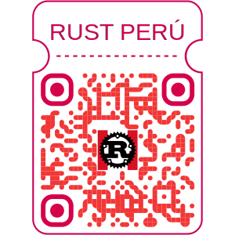

<div align="center">


# 🦀 Curso Completo de Rust 2026

### De Principiante a Experto | Aprende Rust desde Cero

[](https://www.rust-lang.org/)
[](LICENSE)
[](https://rust.pe/)
[]()

[🌐 Website](https://rust.pe/) • [📺 YouTube](https://www.youtube.com/@RustLangPeru) • [💼 LinkedIn](https://www.linkedin.com/company/rustperu/posts/?feedView=all) • [🐙 GitHub](https://github.com/rustperu) • [💬 Telegram](#-únete-a-telegram)

</div>

---

## 🌟 Sobre Este Curso

> **"El aprendizaje puede ser empinado al principio, pero vale la pena. Rust te hará un mejor programador en cualquier lenguaje."**

Este es un curso **completo y moderno de Rust para 2026**, creado con 🧡 por la comunidad de **Rust Perú** 🇵🇪. Cubre desde la instalación hasta temas avanzados como:

- ⚡ Async/Await y programación asíncrona
- 🔧 Macros procedurales
- ⚠️ Unsafe Rust y FFI
- 🏗️ Arquitectura de sistemas
- 🚀 Optimización y rendimiento

**Tiempo estimado:** 4-6 meses  
**Nivel:** De principiante a experto  
**Idioma:** Español 🇪🇸

---

## 📚 Tabla de Contenidos

- [Sobre Rust Perú](#-sobre-rust-perú)
- [Cómo Empezar](#-cómo-empezar)
- [Recursos de Práctica](#-recursos-de-práctica)
- [Consejos y Mejores Prácticas](#-consejos-y-mejores-prácticas)
- [Comunidad y Soporte](#-comunidad-y-soporte)
- [Contribuir](#-contribuir)
- [Licencia](#-licencia)

---

## 🇵🇪 Sobre Rust Perú

Somos la **comunidad de Rust Perú** 🦀, dedicada a promover el aprendizaje y el uso de Rust en nuestro país. Nuestra misión es facilitar el acceso a recursos educativos de calidad y compartir conocimientos para que todos puedan disfrutar de la potencia y seguridad de Rust.

### ¿Por qué Rust?

- ✅ **Seguridad de memoria** sin garbage collector
- ✅ **Rendimiento** comparable a C/C++
- ✅ **Concurrencia** sin data races
- ✅ **Sistema de tipos** poderoso
- ✅ **Comunidad** increíble y acogedora

### Nuestros Valores

- 🤝 **Inclusión:** Todos son bienvenidos, sin importar su nivel
- 📖 **Educación:** Contenido gratuito y de calidad
- 🌍 **Comunidad:** Aprendemos y crecemos juntos
- 🔓 **Open Source:** Todo nuestro material es de código abierto

---

## 🚀 Cómo Empezar

### 1️⃣ Instala Rust

```bash
# Linux y macOS
curl --proto '=https' --tlsv1.2 -sSf https://sh.rustup.rs | sh

# Windows
# Descarga rustup-init.exe desde https://rustup.rs/
```

### 2️⃣ Verifica la Instalación

```bash
rustc --version
cargo --version
```

### 3️⃣ Comienza con el Módulo 0

```bash
# Clona este repositorio
git clone https://github.com/rustperu/curso-rust-2026.git
cd curso-rust-2026

# Navega al Módulo 0
cd basico/modulo-00-instalacion

# Lee el material
cat README.md
```

### 4️⃣ Tu Primer Proyecto

```bash
cargo new hola_mundo
cd hola_mundo
cargo run
```

---

## 📋 Roadmap del Proyecto

- [x] Módulos 0-3: Fundamentos
- [x] Módulos 4-7: Nivel Intermedio
- [ ] Módulos 8-11: Nivel Avanzado (En progreso)
- [ ] Módulos 12-15: Nivel Experto (Planeado)
- [ ] Videos tutoriales para cada módulo
- [ ] Ejercicios prácticos con soluciones
- [ ] Proyectos finales por nivel

---

## 💪 Recursos de Práctica

### Plataformas Recomendadas

| Plataforma | Descripción | Nivel |
|------------|-------------|-------|
| [Rustlings](https://github.com/rust-lang/rustlings) | Pequeños ejercicios interactivos | 🌱 Principiante |
| [Exercism](https://exercism.org/tracks/rust) | Ejercicios con mentoring | 🌿 Intermedio |
| [Advent of Code](https://adventofcode.com/) | Desafíos de programación anuales | 🌳 Avanzado |
| [LeetCode](https://leetcode.com/) | Problemas de algoritmos | 🔥 Todos |

### Documentación Oficial

- 📖 [The Rust Book](https://doc.rust-lang.org/book/) - La biblia de Rust
- 📝 [Rust by Example](https://doc.rust-lang.org/rust-by-example/) - Aprende con ejemplos
- 🔍 [The Rust Reference](https://doc.rust-lang.org/reference/) - Referencia completa
- ⚡ [Async Book](https://rust-lang.github.io/async-book/) - Programación asíncrona

### Libros Recomendados

- 📚 **Programming Rust** (O'Reilly) - Completo y detallado
- 📚 **Rust in Action** (Manning) - Enfoque práctico
- 📚 **Rust for Rustaceans** (No Starch Press) - Nivel avanzado
- 📚 **Zero to Production in Rust** - Web development

---

## 💡 Consejos y Mejores Prácticas

### Durante el Aprendizaje

> 💪 **Practica todos los días**, aunque sea 30 minutos. La consistencia es clave.

> 🤝 **No tengas miedo del borrow checker**. Es tu amigo, te está enseñando mejores prácticas.

### Hábitos Productivos

✅ **Documenta tu código** con `///` y `//!`  
✅ **Lee los mensajes de error completos** (Rust tiene los mejores)

### Cuando Te Atores 🆘

1. 📖 **Lee el mensaje de error completo** - Rust es muy descriptivo
2. 🔍 **Busca en la documentación oficial**
3. 💬 **Pregunta en nuestra comunidad**
4. 🧪 **Usa [Rust Playground](https://play.rust-lang.org/)** para experimentar
5. 🎯 **Simplifica el problema** a un caso mínimo reproducible

---

## 👥 Comunidad y Soporte

### 💬 Únete a Telegram

<div align="center">
  
  <p><em>Escanea para unirte a nuestra comunidad en Telegram</em></p>
</div>

### ❓ Preguntas Frecuentes

¿Tienes dudas? Visita nuestro repositorio de preguntas frecuentes:

👉 [Rust Perú - Preguntas y Dudas](https://github.com/RustPeru/PreguntasDudas)

### 🌍 Comunidad Global

- 💬 [Foro Oficial de Rust](https://users.rust-lang.org/)
- 💬 [r/rust en Reddit](https://www.reddit.com/r/rust/)
- 💬 [Discord de Rust](https://discord.gg/rust-lang)
- 🐦 [Twitter @rustlang](https://twitter.com/rustlang)

---

## 🤝 Contribuir

¡Las contribuciones son bienvenidas! 🎉

### Áreas Donde Puedes Ayudar

- 📝 Mejora o corrige contenido existente
- ➕ Agrega nuevos ejercicios o ejemplos
- 🐛 Reporta errores o typos
- 🌍 Traduce contenido
- 💡 Sugiere mejoras en la estructura

### Código de Conducta

Este proyecto sigue el [Código de Conducta de Rust](https://www.rust-lang.org/policies/code-of-conduct). Por favor, sé respetuoso y acogedor con todos los miembros de la comunidad.

---

## 📜 Licencia

Este proyecto está bajo la Licencia MIT. Consulta el archivo [LICENSE](LICENSE) para más detalles.

---

## 🙏 Agradecimientos

Un agradecimiento especial a:

- 🦀 **The Rust Team** por crear un lenguaje increíble
- 🇵🇪 **La comunidad Rust Perú** por su apoyo y contribuciones
- 🌍 **La comunidad global de Rust** por su documentación y recursos

---

## 📞 Contacto

¿Tienes preguntas o sugerencias? ¡Contáctanos!

- 🌐 Website: [rust.pe](https://rust.pe/)
- 💼 LinkedIn: [Rust Perú](https://www.linkedin.com/company/rustperu/)

---

<div align="center">

### ⭐ Si este curso te está ayudando, considera darle una estrella ⭐

[](https://github.com/rustperu/curso-rust-2026/stargazers)
[](https://github.com/rustperu/curso-rust-2026/network/members)

---

**Hecho con ❤️ por [Rust Perú](https://rust.pe/) 🇵🇪**

*"Un simple código cambia el mundo y aprenderlo es crear al mundo que soñamos."* 🦀

[⬆️ Volver arriba](#-curso-completo-de-rust-2026)

</div>
